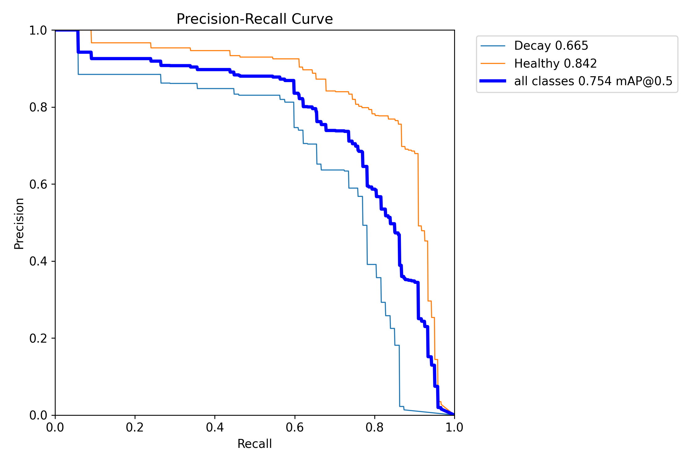
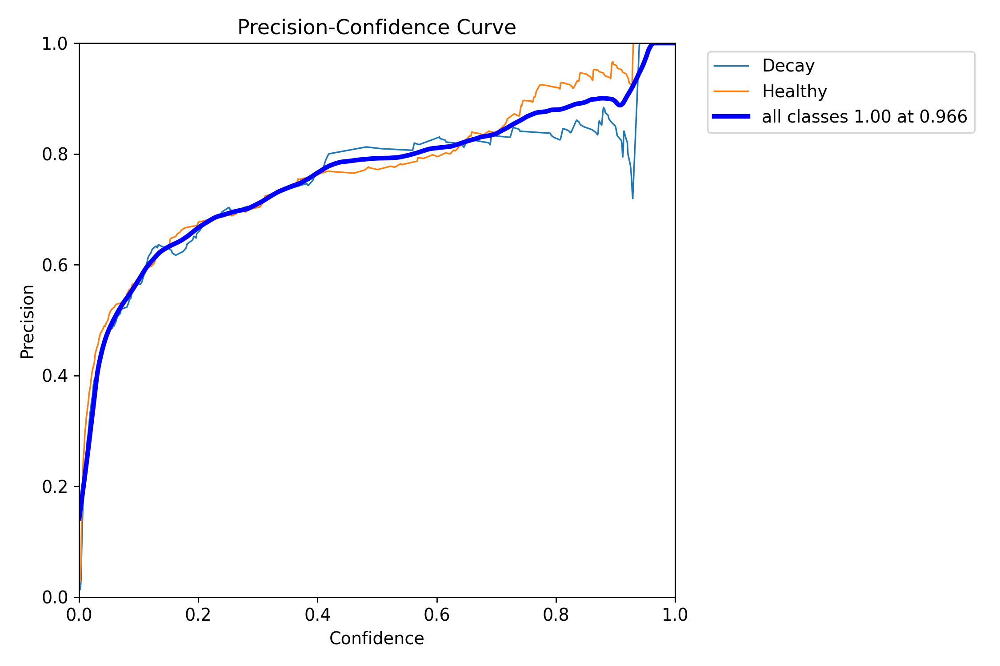
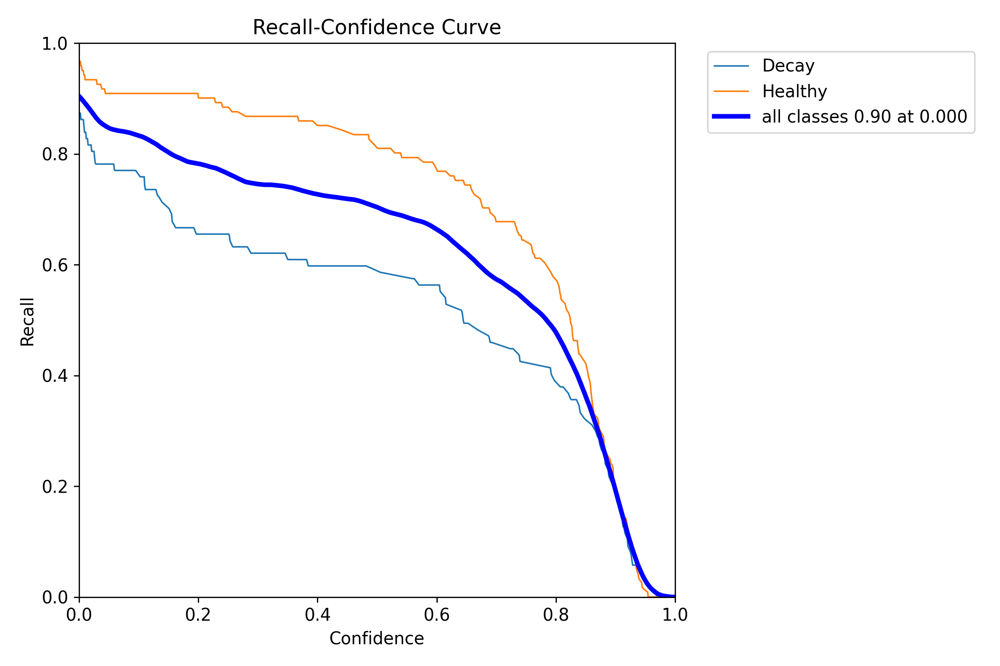
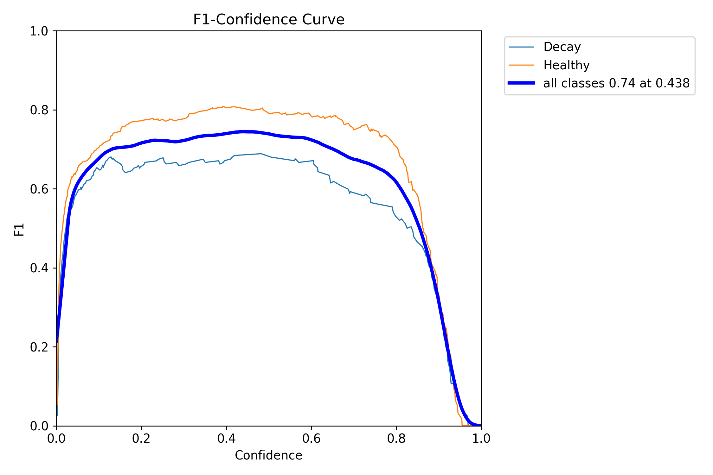
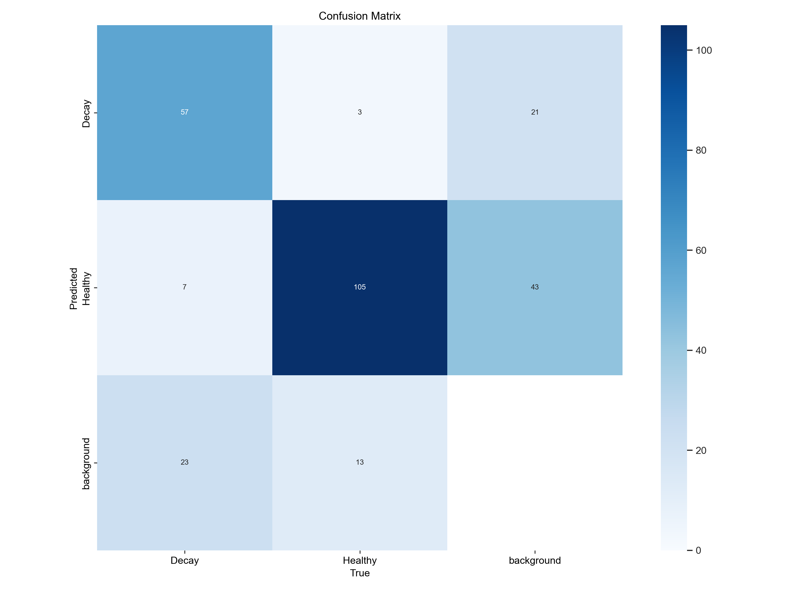
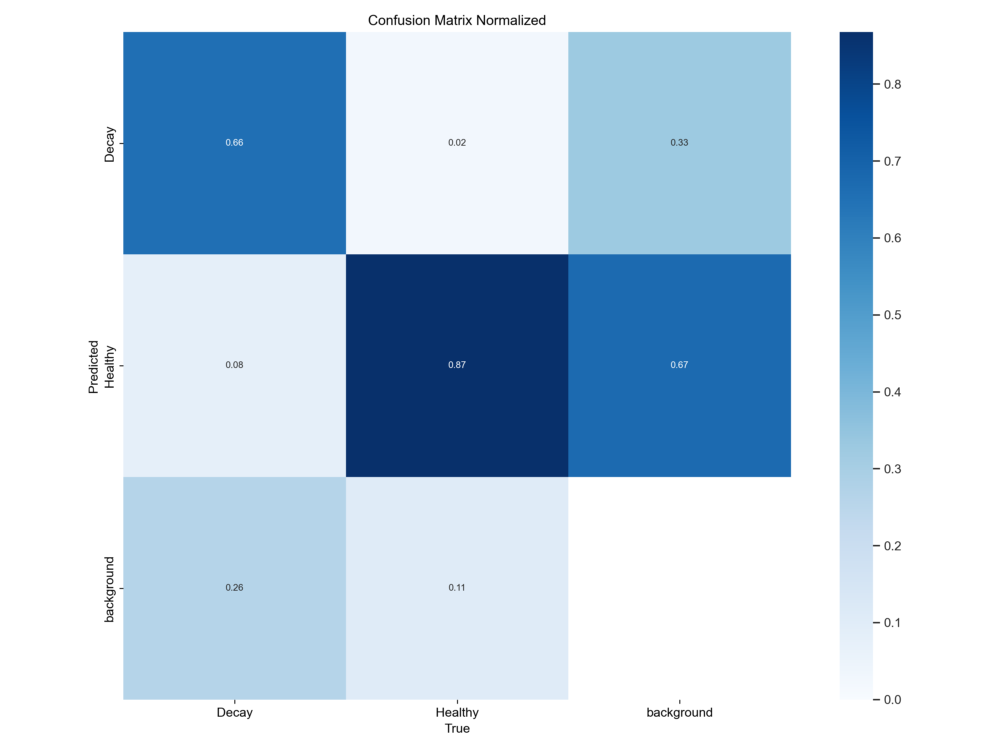

# Dental-Image-Analysis-for-Caries-Recognition

## Overview
This project focuses on the automated detection of dental caries (tooth decay) from dental X-ray images using deep learning techniques. The objective is to assist dentists in early diagnosis by providing a fast and accurate computer-aided detection system.
The model is developed using YOLOv8 object detection and trained on annotated dental X-ray images to identify and localize carious regions.

## Project Highlights
- Developed a dental caries detection system using YOLOv8 object detection.
- Trained on annotated dental X-ray images.
- Achieved **75.4% mAP@0.5** on the test dataset.
- Obtained **74% F1-score** at the optimal confidence threshold.
- Supports automated localization of decayed regions in dental radiographs.
- Provides a fast computer-aided diagnosis tool for dental screening.
  
## Features
* Automated dental caries detection from X-ray images
* YOLOv8-based object detection model
* Detection and localization of caries regions
* Evaluation using standard object detection metrics
* Sample predictions and training results included

## Technologies Used
* Python
* YOLOv8 (Ultralytics)
* OpenCV
* NumPy
* Pandas
* Matplotlib
* Jupyter Notebook
  
## Installation
```bash
git clone https://github.com/deepthikachallakonda0707/Dental-Image-Analysis-for-Caries-Recognition.git
cd Dental-Image-Analysis-for-Caries-Recognition
pip install -r requirements.txt
```

## Usage
Run the Jupyter notebook:
```bash
jupyter notebook Code.ipynb
```

## Pretrained Weights
The trained YOLOv8 model weights (`best.pt`) are not included in this repository due to file size limitations.

## Dataset
The dataset consists of annotated dental X-ray images collected from Roboflow.

**Source:** Roboflow Dental Caries Dataset

Dataset Structure:
- Train
- Validation
- Test

Classes:
- Decay
- Healthy

## Project Structure

```text
Dental-Image-Analysis-for-Caries-Recognition/
├── Code.ipynb
├── dataset/
├── test_images/
├── results/
├── README.md
└── requirements.txt
```

## Model
The project uses YOLOv8 for object detection.
Training Pipeline:
1. Data Collection and Annotation
2. Data Preprocessing
3. YOLOv8 Model Training
4. Model Evaluation
5. Prediction on New Images

## Results
The trained model successfully detects dental caries in X-ray images and demonstrates the effectiveness of deep learning for dental image analysis.
Sample prediction results and evaluation metrics are available in the `results` folder.

## Model Performance
The YOLOv8 model was trained to detect and classify dental caries from dental X-ray images.

### Key Results
| Metric | Value |
|----------|----------|
| mAP@0.5 | 75.4% |
| Best F1 Score | 74.0% |
| Peak Recall | 90.0% |
| Peak Precision | 100.0% (at high confidence threshold) |

### Precision-Recall Curve
The model achieved an overall mAP@0.5 score of **75.4%**, demonstrating effective discrimination between healthy and decayed teeth.


### Precision-Confidence Curve
Precision improves as the confidence threshold increases, reaching nearly 100% at high confidence levels.


### Recall-Confidence Curve
The model achieves a maximum recall of approximately **90%**, indicating strong sensitivity in detecting caries.


### F1-Confidence Curve
The best balance between precision and recall is obtained at a confidence threshold of approximately **0.44**, with an F1-score of **0.74**.


### Confusion Matrix
The confusion matrix illustrates the classification performance across Healthy and Decay classes.


### Normalized Confusion Matrix
Normalized results provide a clearer understanding of prediction accuracy across classes.


## Future Improvements
* Increase dataset size for improved generalization
* Deploy as a web application
* Support detection of additional dental abnormalities
* Improve model performance using advanced augmentation techniques

## Acknowledgements
This project was developed using the following tools and resources:
- Ultralytics YOLOv8 for object detection
- Roboflow for dataset management and annotation
- OpenCV for image processing
- NumPy, Pandas, and Matplotlib for data analysis and visualization
- Jupyter Notebook for model development and experimentation

## Author
**Deepthika Challakonda**
GitHub: https://github.com/deepthikachallakonda0707

## License
This project is licensed under the MIT License.
